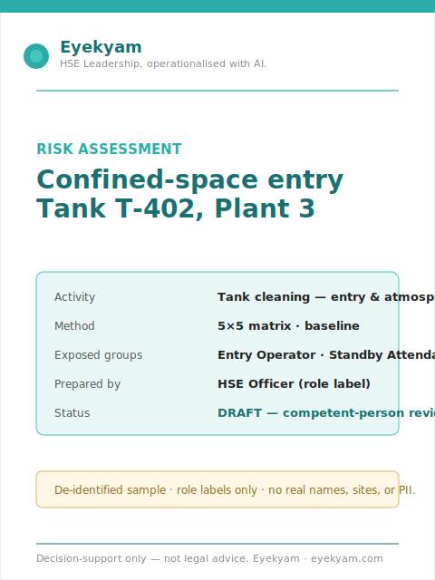
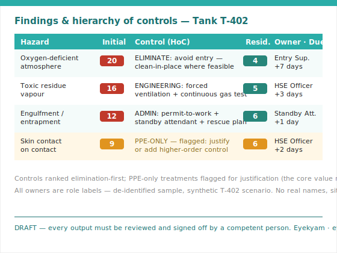
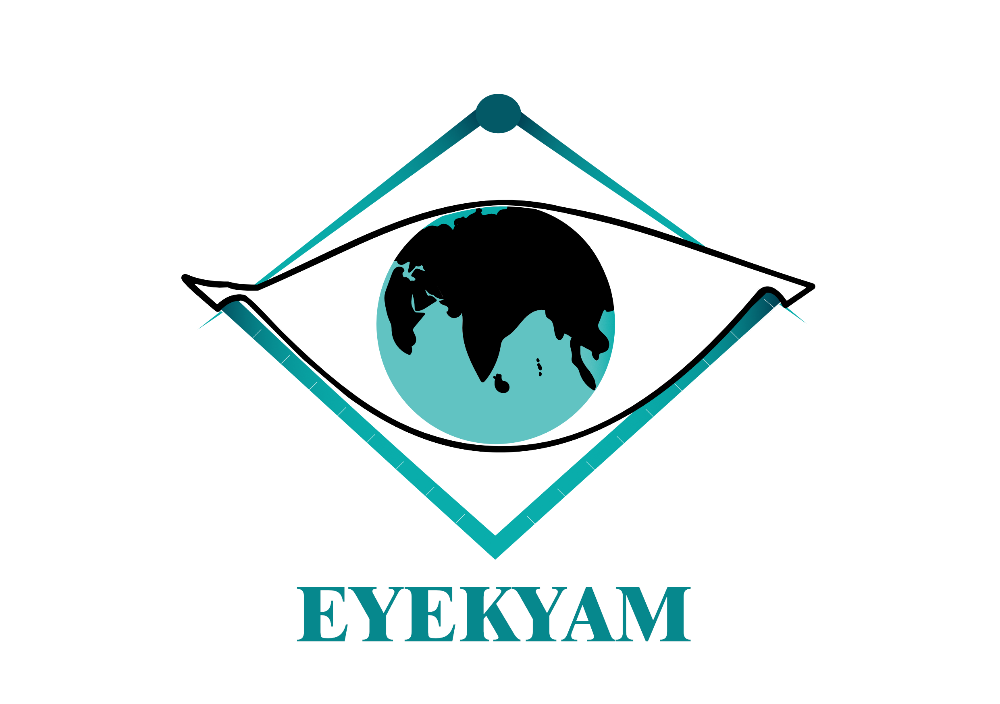
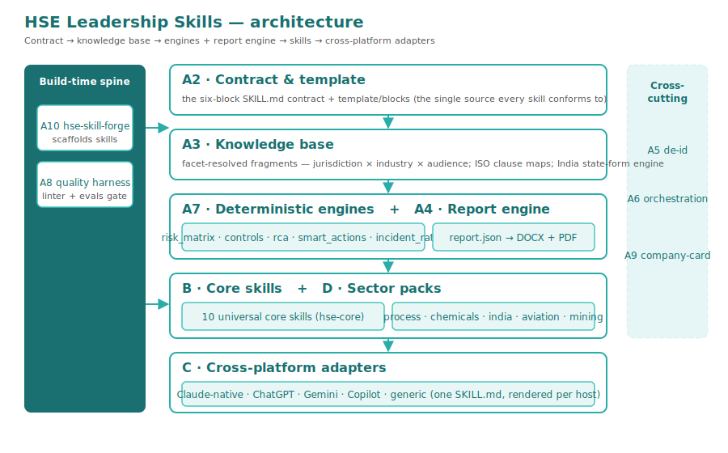

<div align="center">


# HSE Leadership Skills

**Consultant-grade HSE documents — site- and task-specific, hierarchy-of-controls-driven, de-identified — drafted in minutes. Open-source Agent Skills for safety leaders.**

*Build once, run anywhere — one portable `SKILL.md` per skill, rendered to each host by the adapter build.*

[](./LICENSE)
[](https://agentskills.io)
[](https://github.com/ashley-eyekyam/hse-leadership-skills/actions/workflows/validate-skills.yml)
[](https://github.com/ashley-eyekyam/hse-leadership-skills/actions/workflows/eval.yml)
[](https://github.com/ashley-eyekyam/hse-leadership-skills/releases)
[](#whats-in-the-box-the-catalog)
[](#install-in-30-seconds)
[](./CONTRIBUTING.md)

[Get started](#install-in-30-seconds) · [View skills](#whats-in-the-box-the-catalog) · [See it work](#a-60-second-try-it) · [Trust & safety](#trust--safety) · [Read the disclaimer](./DISCLAIMER.md)

</div>

<!--
  docs/assets/demo.gif — the highest-converting hero element — is an owner fast-follow.
  Its scenario (the T-402 risk-assessment end-to-end) is scripted in docs/BRANDING.md.
  It does not block the v1.0.0 tag. The architecture diagram + flagship screenshots below
  are in-repo now.
-->

HSE Leadership Skills is an open-source, cross-platform pack of **Agent Skills** for HSE/safety leaders, managers, frontline supervisors, and external consultants. Each skill forces task- and site-specific output, applies the **hierarchy of controls**, de-identifies sensitive data, and emits a beautifully branded report. The four cross-platform bundles (ChatGPT · Gemini · Copilot · generic) are **CI-validated** — the four non-negotiables (the de-identification block, the structured intake, the hierarchy-of-controls discipline, and the report contract) are proven to survive the render to each host. No host is privileged; all are equal peers.

> **Decision-support only.** Outputs are drafts for competent-person review and sign-off — not legal advice, not approved deliverables. See the full [trust & safety band](#trust--safety) and [`DISCLAIMER.md`](./DISCLAIMER.md).

---

## Install in 30 seconds

Every skill is one portable `SKILL.md`, rendered into each host's format by the adapter build — so the same skill installs on Claude, ChatGPT, Gemini, Copilot, or any open-standard tool.

### Quick start — install the whole pack (Claude)

```text
/plugin marketplace add ashley-eyekyam/hse-leadership-skills
/plugin install hse-all@hse-leadership-skills
```

That single line installs all 48 consultant skills. (The `hse-skill-forge` authoring skill lives in the separate `hse-systems` bundle — install it with `/plugin install hse-systems@hse-leadership-skills`.)

### Or install just what you need

<details>
<summary><strong>Per-pack installs (Claude)</strong></summary>

```text
/plugin marketplace add ashley-eyekyam/hse-leadership-skills
/plugin install hse-core@hse-leadership-skills        # the 10 universal core skills
/plugin install hse-process@hse-leadership-skills     # process-safety pack
/plugin install hse-chemicals@hse-leadership-skills   # chemicals pack
/plugin install hse-india@hse-leadership-skills        # India regional pack
/plugin install hse-aviation@hse-leadership-skills    # aviation SMS pack
/plugin install hse-mining@hse-leadership-skills      # mining pack
```

</details>

### Other platforms

These blocks are **lifted verbatim** from each skill's emitted `adapters/<platform>/<skill>/INSTALL.md` — never hand-authored, so they cannot drift from what the build produces. The example below is `risk-assessment`; every skill ships the same per-platform `INSTALL.md`.

<details>
<summary><strong>ChatGPT — Custom GPT</strong></summary>

1. Create a new Custom GPT (Configure tab).
2. Paste `instructions.md` into the **Instructions** field.
3. Upload every file under `knowledge/` as **Knowledge**.
4. Enable **Code Interpreter & Data Analysis**, then upload the canonical report engine from `assets/report-engine/` (`generate_report.py`, `render_docx.py`, `render_pdf.py`, `theme.py`, the schemas, `brand.yaml`, `house-standard.yaml`, and the `fonts/` directory).
5. Upload the A7 deterministic engines from `scripts/hse_components/` (`risk_matrix.py`, `controls.py`, `rca.py`, `smart_actions.py`, `incident_rates.py`, `__init__.py`, `_shim.py`).
6. The GPT runs `generate_report.py` in Code Interpreter to produce the branded DOCX + PDF.

</details>

<details>
<summary><strong>Gemini — Gem</strong></summary>

1. Create a new Gem.
2. Paste `instructions.md` into the Gem's instructions.
3. Attach every file under `knowledge/` as knowledge.
4. The Gem emits a structured markdown report (no Code Interpreter on this host).

</details>

<details>
<summary><strong>Microsoft Copilot — declarative agent</strong></summary>

1. Register a new declarative agent (Copilot Studio / agent manifest).
2. Use `manifest.json` (declarative-agent schema 1.7) as the agent manifest.
3. Paste `instructions.md` into the agent's instruction field.
4. Attach every file under `knowledge/` as a knowledge source.
5. The agent emits a structured markdown report (no Python execution on this host).

</details>

<details>
<summary><strong>Any other system-prompt host (generic)</strong></summary>

1. Paste `system-prompt.md` as the system prompt.
2. Attach the files under `knowledge/` if the host supports file uploads; otherwise the system prompt's pointers explain that the detail lives there.
3. Run the structured intake conversationally; the host emits a markdown report.

</details>

For local testing and the full setup walkthrough, see [`docs/USER_MANUAL.md`](docs/USER_MANUAL.md) (single-skill setup) and [`docs/USER_JOURNEYS.md`](docs/USER_JOURNEYS.md) (chaining skills for a real task).

---

## What's in the box (the catalog)

Forty-eight consultant skills across **ten universal core skills** and **five sector packs** (presented as equal peers — India is one of five), plus the `hse-skill-forge` contribution on-ramp. Every fact below is drawn from each skill's own `metadata`/`description` — nothing here is hand-classified.

**Audience legend:** **M** = manager · **E** = executive · **F** = frontline · **C** = consultant. **Tier 1** = stable core.

### Core skills — bundle `hse-core`

| Skill | What it does | Audience | Jurisdiction | Tier |
|---|---|---|---|---|
| [`risk-assessment`](skills/risk-assessment/) | Site/task-specific risk assessment, hierarchy-of-controls-driven (the flagship) | M, C, F | All | 1 |
| [`job-safety-analysis`](skills/job-safety-analysis/) | Step-by-step JSA/JHA for physical task work, per-step hazards + controls | M, F, C | All | 1 |
| [`toolbox-talk`](skills/toolbox-talk/) | A < 2-minute, specific frontline safety briefing + sign-off sheet | F, M | All | 1 |
| [`rams-builder`](skills/rams-builder/) | Construction RAMS — risk assessment + method statement, CDM/BOCW-aware | M, C | All | 1 |
| [`incident-investigation`](skills/incident-investigation/) | RCA-driven incident investigation (5-Whys/ICAM/SCAT…), de-id-first, CAPA-bearing | M, C | All | 1 |
| [`safety-audit`](skills/safety-audit/) | Criteria-based safety audit, evidence-traced findings (ISO 45001 9.2) | M, F, C | All | 1 |
| [`capa-manager`](skills/capa-manager/) | Corrective & preventive action lifecycle/register, cause-traced (ISO 45001 10.2) | M, C | All | 1 |
| [`sop-writer`](skills/sop-writer/) | Literacy-level-targeted SOPs/SWPs with HoC embedded in steps (ISO 45001 8.1) | M, C | All | 1 |
| [`board-safety-report`](skills/board-safety-report/) | Board/executive safety narrative with a HiPo/SIF lens — insight, not data | E | All | 1 |
| [`incident-rate-calculator`](skills/incident-rate-calculator/) | Deterministic TRIR/LTIFR/DART rates (script-backed, single-threaded) | M, E | All | 1 |

### Sector packs — equal-peer bundles

| Pack | What it adds | Focus |
|---|---|---|
| [`hse-process`](skills/hse-process/) | Process safety: PSM 14-element, COMAH, HAZOP/HAZID/LOPA/What-If facilitators, bowtie/MoC, PESO | Oil & Gas / Process |
| [`hse-chemicals`](skills/hse-chemicals/) | Chemicals: GHS/CLP SDS, exposure registers, dust & reactive chemistry, transport, MSIHC | Chemicals |
| [`hse-india`](skills/hse-india/) | Cross-sector regional: the legacy-first state-form engine, BOCW/PESO/OSH-Code transition, DPDP-aware de-id | All (IN) |
| [`hse-aviation`](skills/hse-aviation/) | ICAO Annex 19 SMS, SMS-manual builder, SPI/SPT, just-culture, Safety Review Board minutes, FDM/FOQA | Aviation |
| [`hse-mining`](skills/hse-mining/) | Mines Act/DGMS notices & returns, ventilation/strata/blasting, mine-rescue ERP, ICMM critical-control | Mining |

### Contribute a skill — `hse-skill-forge`

> Author a new conformant skill in minutes: [`hse-skill-forge`](skills/hse-skill-forge/) (bundle `hse-systems`) scaffolds the six-block contract, the structured intake, the orchestration roster, the de-identification block, and the eval scaffold — born linter- and eval-shaped. See [`CONTRIBUTING.md`](./CONTRIBUTING.md) and [`docs/AUTHORING_GUIDE.md`](./docs/AUTHORING_GUIDE.md).

### You need to… → use this skill → you get

| You need to… | Use this skill | You get |
|---|---|---|
| Assess a specific task, site, activity, or asset | `risk-assessment` | HIRA/HIRARC, scored initial/residual risk, hierarchy-ranked controls, SMART actions |
| Plan a physical job step by step | `job-safety-analysis` | Per-step hazards, risk scores, controls, residual risk, sign-off-ready JSA |
| Brief a crew before work | `toolbox-talk` | Plain-language talk, discussion prompts, attendance/sign-off sheet |
| Learn from an incident or near miss | `incident-investigation` | De-identified timeline, evidence log, RCA, CAPA, reportability prompt |
| Audit a process or system against criteria | `safety-audit` | Objective evidence, conformities, major/minor NCs, risk-rated corrective actions |
| Turn controls into a repeatable procedure | `sop-writer` | Version-controlled SOP/SWP with roles, competencies, embedded controls |
| Brief the board on systemic risk | `board-safety-report` | Leadership narrative, HiPo/SIF themes, action visibility |

### Use cases by leadership level

| Reader | What they care about | What it gives them |
|---|---|---|
| Frontline supervisor | A fast briefing for today's job | Task-specific toolbox talks + sign-off sheets, no generic patter |
| Shift / operations manager | Work proceeds only when risks are controlled | Residual risk, stop-work flags, owners, due dates, practical controls |
| HSE officer / safety advisor | Defensible drafts, consistent method | Structured intake, de-identification, risk scoring, evidence trails |
| HSE manager / EHS lead | Consistency across sites and audits | One way to produce HIRAs, investigations, audit findings, and CAPAs |
| Plant manager / site leader | Material risk and accountability | Safety work turned into owned actions and visible controls |
| Consultant / auditor | Evidence and professional review | Structured artifacts with objective evidence, assumptions, gaps, boundaries |
| Executive / board member | Systemic themes and assurance | Incidents, audits, and high residual risk turned into leadership questions |

### What makes it different

1. **It does not accept vague safety work.** It forces exact task/site/asset context.
2. **It treats PPE as the last line of defence.** It pushes higher-order controls first.
3. **It is privacy-aware by design.** De-identification runs *before* drafting.
4. **It is evidence-oriented.** Investigations and audits trace conclusions back to numbered evidence.
5. **It creates action, not just prose.** Actions require owners, dates, measures, and links.
6. **It understands HSE workflows.** HIRA, JSA, toolbox talk, incident RCA, audit, SOP each have a distinct method.
7. **It produces professional deliverables.** A structured `report.json` renders to branded PDF and DOCX.
8. **It is open source and extensible.** Authors use `hse-skill-forge` and the authoring guide to add new workflows.

---

## A 60-second "try it"

A single pass on the flagship `risk-assessment` skill makes the core value concrete before you read anything else.

**1 · The prompt (one line):**

```text
Help me risk-assess confined-space entry to clean tank T-402 in Plant 3.
```

**2 · The intake (abbreviated §2.7 structured Q&A).** The skill refuses to proceed on a vague request. It asks — one question at a time — the substance previously in the tank, the entry method, who enters (own workers? contractors?), the atmosphere and gas-testing regime, and any prior incidents. It echoes the captured facts back before any analysis.

**3 · The output (the value made visible):**
- a **site/task-specific** finding set for *this* tank, not generic confined-space boilerplate;
- every control **ranked by the hierarchy of controls** — elimination first, PPE-only treatments flagged;
- **de-identified** throughout (role labels, no names);
- every recommendation carrying a **named owner + due date**;
- then the **branded report** (DOCX + PDF), rendered with the Eyekyam default brand.

**4 · The deliverable:**

<div align="center">
  
  
</div>

*Sample data is fully synthetic and de-identified (the T-402 scenario uses role labels, no real names or sites).*

---

## Trust & safety

> **Disclaimer — decision-support only.**
>
> The HSE Leadership Skills pack is a **decision-support tool**. Its outputs are drafts to assist a qualified professional — **not** finished, authoritative, or approved deliverables. **Every output must be reviewed, validated, and signed off by a competent person** (a suitably qualified and experienced health, safety & environment professional) **before it is relied upon or acted on.**

The line above is quoted verbatim from [`DISCLAIMER.md`](./DISCLAIMER.md) — read it in full before using any output.

- **De-identification guarantee.** Every skill carries a mandatory de-identification step (GDPR Art. 9 / India DPDP / OSHA privacy-case aligned) — personal and special-category health data is stripped or pseudonymised *before* any output is shared.
- **Quality gate.** Every skill ships ≥ 3 evals, must score a weighted ≥ 4.0 with no hard-fail (a de-identification leak or an invented citation is an automatic fail), and passes a competent-person HSE review before it merges. Contributed skills pass the **same** gate.
- **Grounded in** ISO 45001 / ISO 14001 / ISO 45003, OSHA, UK HSE, EU, and India legacy frameworks — referenced as peers, each to be verified against the current authoritative source for your jurisdiction.

---

## Customize & brand

Make every output your own by editing **two files**: `brand.yaml` (your colours, logo, fonts — the visual theme) and `company-card.yaml` (your name, tagline, contact — the attribution). One edit re-brands the whole pack. It ships with the **Eyekyam default**, so it looks finished out of the box.

See [`docs/BRANDING.md`](docs/BRANDING.md) for the full how-to (the two-file override, the report-branding default, logo usage, and how to regenerate the visual assets).

## About Eyekyam

<div align="center">
  
</div>

This public repo is built and maintained by **Eyekyam Risk Resolutions Pvt. Ltd.**, registered office at Gurugram, India.

For questions, custom skills, or training, contact [ashley@eyekyam.com](mailto:ashley@eyekyam.com).

---

## Roadmap & community

**v1.0** is the toolbox — the 48 consultant skills, the five sector packs, and the cross-platform adapters shipped here. **v2.0 ("HSE GStack")**, a process-driven workflow plugin, is explicitly deferred and out of scope for this milestone.

- **Contribute in 5 minutes** with [`hse-skill-forge`](skills/hse-skill-forge/) — it scaffolds a born-conformant skill so you can focus on the HSE content.
- **Propose a skill** via the [new-skill-proposal issue template](.github/ISSUE_TEMPLATE/new_skill.md).
- **Good first issues** — start with the [`good first issue`](https://github.com/ashley-eyekyam/hse-leadership-skills/issues?q=is%3Aissue+is%3Aopen+label%3A%22good+first+issue%22) label.
- **Ask a question** in [GitHub Discussions](https://github.com/ashley-eyekyam/hse-leadership-skills/discussions).
- **Featured community skills** — community-contributed skills that pass the quality gate are featured here as the pack grows.

How it all fits together:

<div align="center">
  
</div>

---

## License

[Apache-2.0](./LICENSE) — Copyright 2026 Eyekyam.

Footer links: [`LICENSE`](./LICENSE) · [`DISCLAIMER.md`](./DISCLAIMER.md) · [`CONTRIBUTING.md`](./CONTRIBUTING.md) · [`docs/BRANDING.md`](docs/BRANDING.md) · [`docs/AUTHORING_GUIDE.md`](docs/AUTHORING_GUIDE.md)
